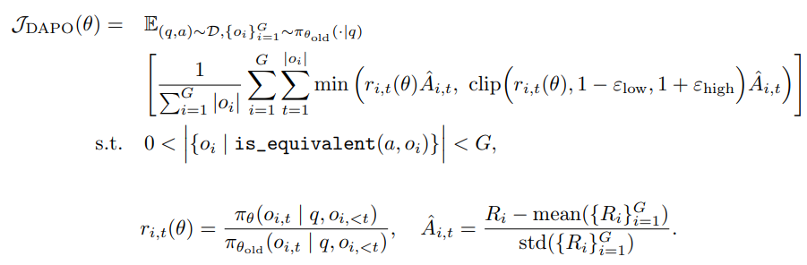

# 动态采样策略优化（Dynamic sAmpling Policy Optimization, DAPO）

<div align="center">
  
</div>

DAPO主要针对GRPO进行优化，首先有两个基本优化：
1. 移除KL散度约束：DAPO认为thinking模型随着训练步长增加，其分布会与原本的base模型差异较大，因此KL散度约束其实并没有太大必要
2. Rlue-based RM：为了防止reward model出现reward hacking现象，DAPO直接使用accuracy来计算奖励：

$$ R(\hat{y},y)=\begin{cases}
1, & \text{IsEquivalent}(\hat{y},y) \\
-1, & \text{otherwise}
\end{cases} $$

## 具体优化措施
### 1. Clip-Higher
DAPO发现，随着训练步数的增加，在GRPO和PPO中会出现一种"generation entropy"降低的情况，也就是在一个组中采样的回复基本都是一致的，原文提出这个现象会导致：
```text
This indicates limited exploration and early deterministic policy, which can hinder the scaling process.
```
GRPO、PPO这些算法中clip的 $\epsilon = 0.2$ ，假设 $\pi\_{\theta\_{\text{old}}}(o\_{i,t} \mid q, o\_{i,<t}) = 0.01 \text{and} 0.9$，那么新策略 $\pi\_{\theta}(o\_{i,t} \mid q, o\_{i,<t})$ 最大可能更新的概率值分别为0.012和1.08，这意味着对于预测概率比较小的tokens的更新幅度非常有限。

### 2. Dynamic Sampling
假设一组response都是正确的，即reward都为1，那么根据计算 $A$ 值的公式，则得到 $A=0$ ，则就导致梯度也为0，policy不会得到任何更新。因此为了高效性，筛除了那些response全对或全错的样本，即：
$$0 < |\{o\_i \mid \text{IsEquivalent}(a,o\_i)\}| < G$$
通过实验观测得到，dynamic samling的策略可以提高训练效率（达到相同性能的step减小）

### 3. Token-Level Policy Gradient Loss
在GRPO中，loss计算是sample-level的，即先计算每个 $o_i$ 的平均loss，再在组里求平均。这就意味着每个sample参与计算loss的weight是一致的。这就导致较长回复中的token（包含更多token）可能在整体损失中的贡献度不成比例地降低，这可能导致两个不利影响：
- 首先，对于高质量的长样本，这种效果可能会阻碍模型学习其中与推理相关的模式。
- 其次，过长的样本通常表现出低质量的模式，比如胡言乱语和重复用词。因此，样本级别的损失计算无法有效地惩罚长样本中这些不良模式。
因此，在DAPO的Loss函数中将其修改成了token-level的loss计算。在这种设置下，长序列相较于短序列会对梯度更新产生更大的影响。

### 4. Overlong Reward Shaping
在RL的训练中，通常会为generation设定一个最大长度，这就导致过长的样本会被截断，因此会导致如下情况：
```text
This approach may introduce noise into the training process, as a sound reasoning process can be penalized solely due to its excessive length. Such penalties can potentially confuse the model regarding the validity of its reasoning process.
```
因此，DAPO中设计了一个**Soft Overlong Punishment**，从而用于惩罚那些过长的样本，避免模型生成过长的响应

$$ R_{\text{length}}(y)=\begin{cases}
0, & |y| \leq L_{\text{max}} - L_{\text{cache}} \\
\frac{(L_{\text{max}}-L_{\text{cache}})-|y|}{L_{\text{cache}}}, & L_{\text{max}} - L_{\text{cache}} < |y| \leq L_{\text{max}} \\
-1, & L_{\text{max}} < |y|
\end{cases} $$

