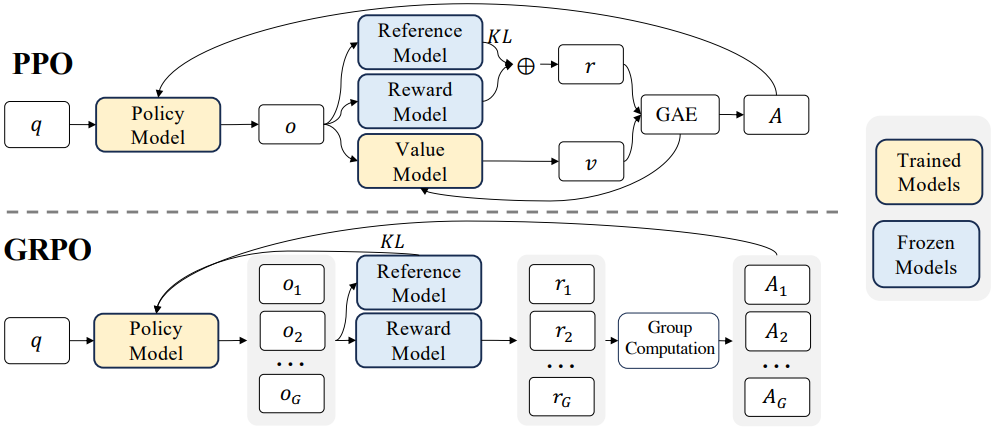
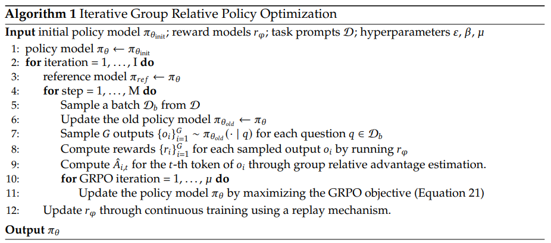

# 群体相对策略优化（Group Relative Policy Optimization, GRPO）
## 📘 GRPO 目标函数

$$\mathcal{J}\_{\text{GRPO}}(\theta) = \mathbb{E}\_{q \sim P(Q), \{o\_i\}\_{i=1}^G \sim \pi\_{\text{old}}(O|q)} \left[ 
\frac{1}{G} \sum\_{i=1}^{G} \frac{1}{|o\_i|} \sum\_{t=1}^{|o\_i|} 
\left\{ 
\min \left[
\frac{\pi\_\theta(o\_{i,t}|q, o\_{i,<t})}{\pi\_{\text{old}}(o\_{i,t}|q, o\_{i,<t})}, 1 - \epsilon, 1 + \epsilon 
\right] \hat{A}\_{i,t} 
\right\} - \beta \mathbb{D}\_{\text{KL}} \left[ \pi\_\theta \| \pi\_{\text{ref}} \right] 
\right]$$

其中，$\epsilon$ 和 $\beta$ 是超参数， $A^{i,j}$​ 是基于组内奖励的相对优势估计。

**PPO的值函数通常是一个与策略模型大小相当的模型，这带来了显著的内存和计算负担**。

而GRPO不再需要像PPO那样加入额外的价值函数近似，而是直接使用多个采样输出的平均奖励作为Baseline，显著减少了训练资源的使用。此外，GRPO 通过直接在损失函数中加入策略模型和参考模型之间的 KL 散度来正则化，而不是在奖励中加入 KL 惩罚项，从而简化了训练过程。

  

## GRPO 算法流程

  

GRPO针对每个问题，从policy model中采样$G$个输出结果，并分别计算这$G$个结果的reward值（比如答案是否正确，格式是否正确，R1所使用的RM），然后通过下列公式计算第$t$步第$i$个输出的A值：
$$\hat{A}\_{i,t} = \frac{r\_i - \text{mean}(\mathbf{r})}{\text{std}(\mathbf{r})}$$
然后用于最大化GRPO的目标函数 $\mathcal{J}\_{\text{GRPO}}(\theta)$

## DeepSeek-R1的一些失败尝试

### 过程奖励模型（Process Reward Model, PRM）
R1曾经尝试使用PRM来解决推理问题，但PRM的缺陷在于：
1. 在general reasoning中很难去定义细粒度的推理过程；
2. 决定某个reasoning step是否正确是很难定义的，人工标注很难使得数据scaling up;
3. 如果用模型去标注哪个step正确与否，很容易reward hacking。

### 蒙特卡洛树搜索（Monte Carlo Tree Search, MCTS）
蒙特卡洛树搜索要求模型能够通过自主探索解空间来找到最终答案。但缺陷在于：
1. 对于general question，并没有如一些游戏（alphago的围棋）有well-defined的解空间，相反general question的解空间可能非常大；
2. 针对问题1，R1尝试设置extention limit（即在某个node不会无限往下延伸），但这又可能会导致模型陷入局部最优解；
3. MCTS的搜索是由Value Model来引导的，这就意味值Value Model的质量非常重要；而训练如此这样一个细粒度的Value Model的难度非常大。